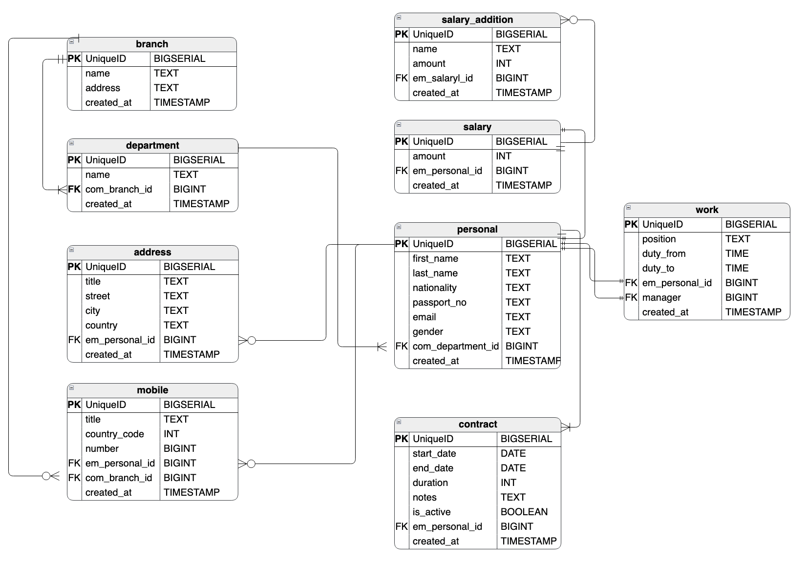

# Employee Management System (EMS) REST API

### Introduction:

The Employee Management System (EMS) is a REST API built using Java and Spring Boot that provides endpoints for managing employee-related information and processes. This API allows clients to interact with the system programmatically, enabling businesses to efficiently manage their employees' data.

### **Table of Contents:**

* **[Features](#features)**
* **[Technologies Used](#technologies-used)**
* **[Setup](#setup)**
* **[ERD](#erd)**
* **[API Endpoints](#api-endpoints)**
* **[Contact](#contact)**

### Features:

**Branch Management:** Endpoints to add, update, and delete branch information.

**Department Management:** Endpoints to add, update, and delete department 
information.

**Employee Management:** Endpoints to add, update, and delete employee (personal, work, contract, and salary ) 
information.

### Technologies Used:

* Java
* Spring Boot
* Spring Data JPA & Hibernate
* Postgresql
* Lombok
* ModelMapper

### Setup:

To get started with the EMS REST API, follow these steps:

1. **Prerequisites:** Ensure you have Java, and a Postgresql database installed and set up on your system.

2. **Clone the Repository:** Clone this repository to your local machine using 
   the following command:

`git clone https://github.com/ahmed-sallam/ems.git`

3. **Configuration:** Configure the database connection and other settings in 
   the **application.properties** file located in the **src/main/resources** directory.

4. **Run the Application:** Use your IDE or the following command to run the application:
`./mvnw spring-boot:run`

5. **Access the API:** The EMS REST API is now up and running. You can use your 
   preferred API client (e.g., Postman) to interact with the endpoints.

### ERD:

### API Endpoints:

1. The EMS REST API provides the following endpoints (still adding):
2. **GET /api/v1/branches**: Get a list of all branches.
3. **POST /api/v1/branches**: Add a new branch.
4. **GET /api/v1/branches/{id}**: Get a specific branch by ID.
5. **DELETE /api/v1/branches/{id}**: Delete a branch.
6. **PUT /api/v1/branches/{id}**: Update details of an existing branch.
7. **GET /api/v1/branches/{id}/departments**: Get departments of an existing branch.
8. **GET /api/v1/departments**: Get a list of all departments.
9. **POST /api/v1/departments**: Add a new department.
10. **GET /api/v1/departments/{id}**: Get a specific department by ID.
11. **DELETE /api/v1/departments/{id}**: Delete a department.
12. **PUT /api/v1/departments/{id}**: Update details of an existing department.
13. **GET /api/v1/addresses**: Get a list of all addresses.
14. **POST /api/v1/addresses**: Add a new address.
15. **GET /api/v1/addresses/{id}**: Get a specific address by ID.
16. **DELETE /api/v1/addresses/{id}**: Delete a address.
17. **PUT /api/v1/addresses/{id}**: Update details of an existing address.
18. **GET /api/v1/personals**: Get a list of all employees personal info.
19. **POST /api/v1/personals**: Add a new employee personal info.
20. **GET /api/v1/personals/{id}**: Get a specific employee personal info by ID.
21. **DELETE /api/v1/personals/{id}**: Delete an employee personal info.
22. **PUT /api/v1/personals/{id}**: Update details of an existing employee personal info.

### Contact

If you have any questions or suggestions regarding the EMS REST API, feel free to contact us at:

 Email: devahmedsallam@gmail.com

 Website: [https://tech-peak.com](https://tech-peak.com)

 LinkedIn: [https://www.linkedin.com/in/ahmed-awwad-2b6b4565/](https://www.linkedin.com/in/ahmed-awwad-2b6b4565/)