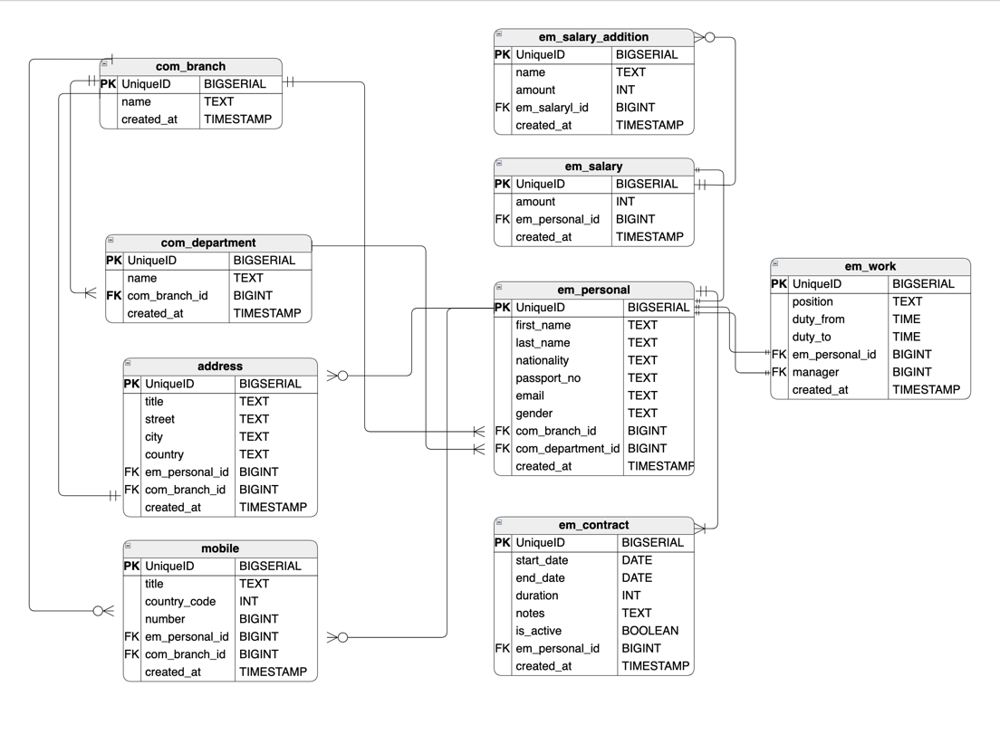

Employee Management System (EMS)

# **About:**

An Employee Management System is a software application that helps organizations manage their employees. Some of the main features and functionalities are:

Employee database: A central repository of employee information, such as personal details, contact information, job title, department, salary, benefits, performance reviews, etc.

## **Tech Stack:**

Programming language: Java 

Web framework: Spring Boot

## **ERD**

